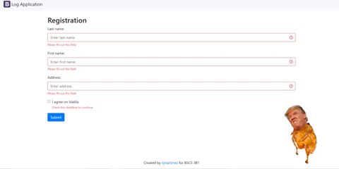

# ==Log Application==

Contributors: Jhonnel Garcia, Kristine Joy Martinez  
Tags: php, freesqldatabase, heroku  
Requires a browser, editor(VScode), php(any version will do), workbench(optional)

## ==Description==

Log application is a web application developed to get the user's full name, address, and time of registration. This helps us monitor every people in certain public areas such as Hospitals, Malls, Parks, and many more. It is advantageous, especial in this pandemic, to ensure the safety of our beloved citizens.

 
This web application aims to help any institutions or corporations that are struggling in recording any interactions with the citizens. It also provides accurate time and address to help trace any person that are suspected to be infected or carrier of the virus.

## Visual

## Installation

Clone the repository by copying this code:  

'''
git clone https://github.com/LilJho/logApp-Garcia.git
'''

then import the db.sql in workbench or phpmyadmin, edit the path files in index.php, config.php and db.php with the location of the imported database. After configuring the database, try running it in your local computer.

 
 

# Author

Garcia, Jhonnel T.

